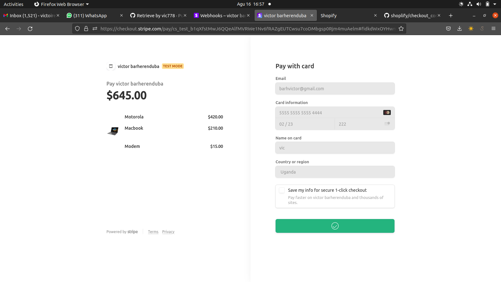
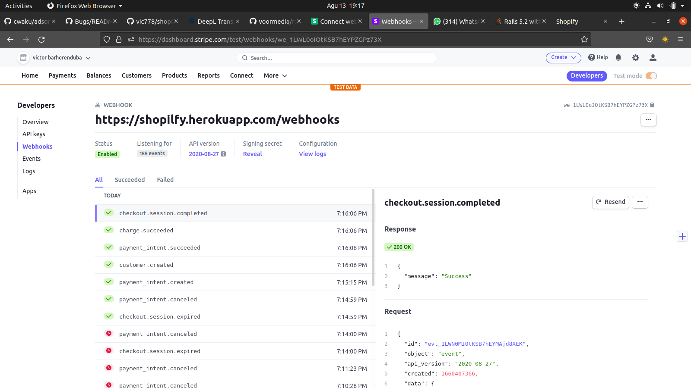
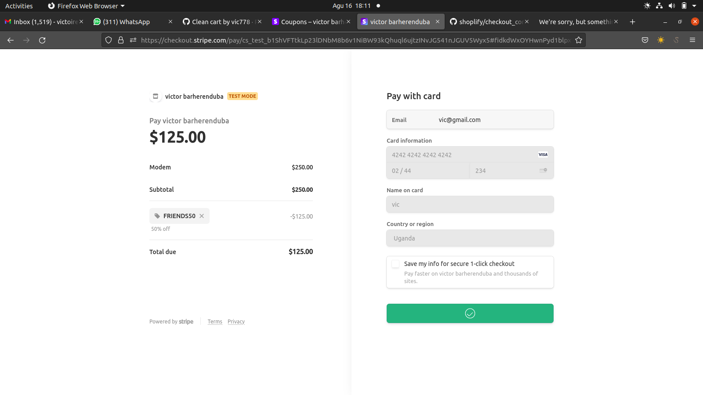

# SHOPIFY

> Shopify is an E-commerce website where users can buy stuff. It has a payement method using `Strip` and it has a webhooks controler to check if the payemt was succed and incres the sales_acount of an item after the payemnt. the current_user is a customer and when the admin create an itm it will create autoamaticaly a stripe id for that product into the STRIPE DB. it has a code promo for reduice the price. when you update the price of an item localy it will be updated into the stripe database. `i Used rails credentials to keep my keys secured loool`. This API is made these models:

  - Item
  - Stripe checkout
  - Sripe webooks
  - Stripe Cart

it has a webhooks controler to check if the payemt was succed

It has a code promo stuff. that makes it funy. i you wanna try `FRIEND50` or `RECRUTERS5`

### Deployment
[Heroku]()
## Built With

- Rails
- Ruby 
- Postgresql
- Devise
- Stripe
- Active storage
- Trix-rails
- Money-rails
- Heroku

## Getting Started

Here are the steps to follow in order to get this project on your local computer.

### Prerequisites

`rails v7.0.2 +`

`ruby v3.0.2 +`

### Setup

clone this repo by typing `git clone https://github.com/vic778/shopify`

### Install

install the dependencies by typing `bundle install`

### Usage

start the local server by running `rails s`

### Testing

run the tests by typing `bundle exec rspec`

### Documentation

## Author

👤 **Victor Barh**

- GitHub: [@Vvic778](https://github.com/vic778)
- Twitter: [@victoirBarh](https://twitter.com/)
- LinkedIn: [LinkedIn](https://linkedin.com/in/victoir-barh)

## 🤝 Contributing

Contributions, issues and feature requests are welcome!

Feel free to check the [issues page](issues/).

## Show your support

Give a ⭐️ if you like this project!

## Acknowledgments

 N/A

## 📝 License

This project is [MIT](lic.url) licensed.